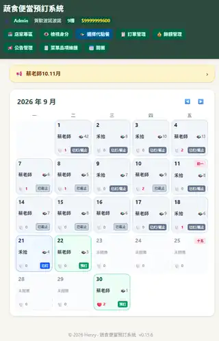
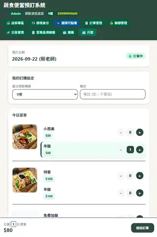
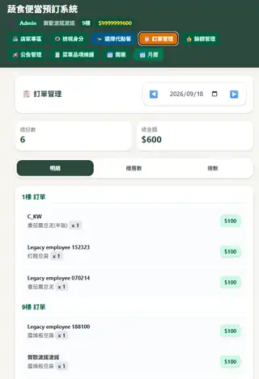

# 蔬食便當預訂系統（Frontend）

這是公司蔬食便當預訂系統的 React/Vite 前端，透過 LINE LIFF 提供登入、查看開團月曆、選餐、送出或取消訂單，以及餘額與交易紀錄查詢。正式架構使用 Cloudflare Worker + D1；前端預設使用 Worker transport，沒有自動 fallback 到 GAS。

## Built for Real-World Lunch Operations

這套系統從公司日常蔬食便當流程逐步演化，涵蓋開團月曆、手機點餐、跨樓層取餐，以及 Admin 訂單彙整。以下畫面呈現實際操作流程，而不是獨立的 UI demo。

<table>
  <tr>
    <td width="33%" align="center">
      
      <br />
      <sub>開團月曆：查看每日店家、訂單狀態與預訂進度</sub>
    </td>
    <td width="33%" align="center">
      
      <br />
      <sub>點餐流程：選擇餐點、份量、領取樓層並送出訂單</sub>
    </td>
    <td width="33%" align="center">
      
      <br />
      <sub>訂單管理：明細、樓層數與總數切換</sub>
    </td>
  </tr>
</table>

## 目前功能

- LINE LIFF 登入、未註冊使用者註冊，以及員工訪客登入流程。
- 員工編號綁定、訪客 onboarding、個人姓名與預設領取樓層維護。
- 月曆開團瀏覽、日期按讚、截止時間與訂單狀態提示。
- 店家專區（需 Worker transport）：店家資訊、菜單快照、官方菜單連結與近期開團紀錄。
- 點餐、修改既有訂單、取消訂單、備註、領取樓層與餐點圖片預覽。
- Admin／ProxyAdmin 的訂單摘要、依領取樓層彙總、代點餐與 View As 檢視。
- Admin 餘額管理、交易紀錄、儲值、員工編號綁定、公告管理與菜單品項變更維護。
- 頁尾版本號與 UI changelog 顯示。

## 技術與目錄

- React 19 + Vite 8
- Tailwind CSS 4、`@tailwindcss/vite`
- LINE LIFF SDK、SweetAlert2、Oxlint
- 正式後端：`worker-poc/` 內的 Cloudflare Worker + D1

```text
.
├─ src/
│  ├─ App.jsx                 # 頂層身份、導覽、狀態與功能協調
│  ├─ main.jsx                # React 掛載與頁面啟動
│  ├─ api/                    # Worker facade、transport 與 legacy GAS adapter
│  ├─ auth/                   # LIFF、員工訪客、權限與 session
│  ├─ components/             # 共用登入、身份、公告、Modal 等元件
│  ├─ features/
│  │  ├─ admin/               # 訂單摘要、公告、菜單維護
│  │  ├─ balances/            # 餘額、交易與儲值
│  │  ├─ calendar/            # 月曆與開團管理
│  │  ├─ orders/              # 菜單、點餐、訂單確認與取消
│  │  └─ vendors/             # 店家專區與店家 metadata
│  ├─ data/                   # changelog 資料
│  └─ observability/          # 啟動效能紀錄
├─ public/                    # favicon、icon sprite、OG preview
├─ tests/                     # 前端結構與 UI contract 測試
├─ worker-poc/                # 正式 Worker/D1 runtime、migration 與後端測試
├─ gas/                       # 已退休的 GAS legacy regression artifacts
├─ index.html
├─ vite.config.js
└─ package.json
```

後端 Worker 的路由、D1 migration 與測試請參閱 [`worker-poc/README.md`](worker-poc/README.md)，不要把 `worker-poc/` 的指令當成前端指令在根目錄執行。

## 本地開發

需求：Node.js 與 npm。

```powershell
npm install
Copy-Item .env.example .env.local
# 編輯 .env.local，填入實際的 LIFF ID 與 Worker URL
npm run dev
```

Vite 預設在 `http://localhost:5173` 啟動。正式 Worker 通常使用已部署的遠端 URL；前端本地開發不需要在根目錄另啟動 Wrangler Worker。

### 環境變數

`.env.example` 是目前設定範本；`.env`、`.env.local` 與其他 local env 檔案不應提交至 Git。

| 變數 | 用途 |
| --- | --- |
| `VITE_AUTH_MODE` | 正式使用 `liff`；只有 Vite development mode 才能啟用 `mock`。 |
| `VITE_LIFF_ID` | LINE LIFF app ID；LIFF 模式必填。 |
| `VITE_API_TRANSPORT` | 省略或設為 `worker` 會使用 Worker；`gas` 僅保留給 legacy regression。 |
| `VITE_WORKER_API_URL` | Worker transport 的 HTTP(S) base URL；Worker 模式必填。 |
| `VITE_GAS_API_URL` | 只有明確使用 `VITE_API_TRANSPORT=gas` 時才需要。 |
| `VITE_MOCK_USER` | mock 情境：`user`、`admin`、`proxy-admin`、`admin-unverified`、`admin-unbound`、`guest-admin` 或 `unregistered`。 |

正式／LIFF 模式的最小設定：

```dotenv
VITE_AUTH_MODE=liff
VITE_LIFF_ID=your-liff-id
VITE_API_TRANSPORT=worker
VITE_WORKER_API_URL=https://your-worker.example.workers.dev
```

本地 mock 只在 `npm run dev` 這類 development mode 生效，不會呼叫網路 API：

```dotenv
VITE_AUTH_MODE=mock
VITE_MOCK_USER=admin
```

## 身份與傳輸邊界

- `src/auth/` 負責 LIFF 與員工訪客 authentication；Worker 以 Bearer token 判定 canonical identity。
- Worker 是正式身份、權限、餘額與新功能的唯一來源。前端不以 client-supplied user ID、role 或 balance 作為授權依據。
- authenticated identity、View As identity 與 effective identity 維持分離；View As 是唯讀檢視，代點餐則是獨立的目標使用者流程。
- `src/api/apiClient.js` 暴露 domain-oriented facade，`src/api/apiClientCore.js` 負責 Worker 路由與錯誤分類。
- `src/api/gasApi.js` 只作為明確選取時的 legacy adapter 與 regression seam，不是 Worker 失敗時的 fallback，也不應在此新增 production business logic。

## 驗證與建置

常用的前端檢查與預覽指令如下：

```powershell
node --test tests/strict-identity-ledger.test.cjs
npm run lint
npm run build
npm run preview
```

`npm run build` 產生可部署的 `dist/` 靜態檔案；根目錄沒有前端 deploy script，實際 hosting／部署由環境流程處理。Worker 部署、D1 migration、正式 LIFF 登入與 View As runtime 行為不會因本地 lint 或 build 而被視為已驗證。

若要測試需要公開 HTTPS LIFF endpoint 的情境，可檢視並執行 [`dev-start.ps1`](dev-start.ps1)。此 launcher 會啟動 Vite、建立 Pinggy tunnel 並更新 LIFF endpoint，另外需要 LIFF CLI、LINE channel 權限與可用的 Pinggy SSH 環境；一般前端開發不需要執行它。

## 相關文件

- [Worker + D1 說明](worker-poc/README.md)
- [React-to-Worker transport 邊界](docs/react-worker-cutover-matrix.md)
- [身份驗證架構](docs/identity-verification-architecture.md)
- [版本變更紀錄](CHANGELOG.md)
